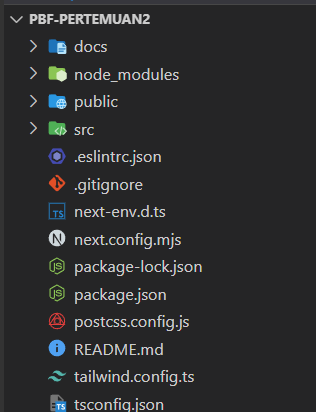

# Pemrograman Berbasis Framework - Pertemuan 2

## Introduction

I'm Maulidio Farhan Rizkullah with student ID 2141720041. I'm currently study in TI-3C class of State Polytechnic of Malang. With a passion for technology and a knack for problem-solving, I'm constantly seeking to expand my knowledge and skills in the field of programming.

## Table of Contents

- [Introduction](#introduction)
- [Table of Contents](#table-of-contents)
- [Author](#author)
- [Documentation](#documentation)
- [Contact Me](#contact-me)

## Author

- [@DioGitH](https://www.github.com/DioGitH)

## Documentation
### Praktikum 1
#### Langkah 1 dan 2

#### Soal 1
- ***Typescript***

Typescript adalah bahasa pemrograman berbasis JavaScript yang menambahkan fitur strong-typing & konsep pemrograman OOP klasik ( class, interface). TypeScript disebut sebagai super-set dari JavaScript, yang berarti semua kode JavaScript adalah kode TypeScript juga. Bahasa pemrograman ini menawarkan class, module, dan interface yang membuat developer bisa mengembangkan aplikasi kompleks dengan lebih mudah.

- ***ESLint***

 ESLint adalah sebuah tools untuk melakukan static analyzes kode kita agar kita tau dengan cepat menemukan masalah atau potensi bug dari kode yang sudah kita buat.

- ***Tailwind CSS***

Tailwind CSS adalah utility-first framework CSS yang didesain untuk mempermudah dan mempercepat pembuatan aplikasi menggunakan desain custom.

- ***App Router***

App Router pada Next.js merupakan sebuah fitur baru yang diperkenalkan pada versi 13. Fitur ini menghadirkan cara baru dalam membangun aplikasi web dengan memanfaatkan fitur-fitur terbaru React seperti Server Components, Streaming with Suspense, dan Server Actions.

- ***Import alias***

Import alias pada Next.js memungkinkan Anda untuk memberi nama baru pada modul atau variabel yang diimpor.
#### Langkah 3

#### Soal 2

- ***Folder:***

    **.git:** Berisi informasi tentang history versi kode aplikasi.

    **src/app:** Berisi file konfigurasi aplikasi Next.js, seperti app.tsx dan routes.tsx.

    **node_modules:** Berisi modul Node.js yang digunakan oleh aplikasi.

    **public:** Berisi aset statis yang dapat diakses langsung oleh browser (gambar, CSS, JavaScript).

- ***File:***

    **.eslintrc.json:** Berisi konfigurasi ESLint untuk linting kode JavaScript.

    **next-env.d.ts:** Berisi deklarasi tipe untuk variabel environment Next.js.

    **next.config.mjs:** Berisi konfigurasi Next.js untuk aplikasi dalam format JavaScript module.

    **package-lock.json:** Berisi daftar dependensi aplikasi dan versi spesifiknya.

    **package.json:** Berisi informasi tentang dependensi aplikasi (instalasi dan pengelolaan).

    **postcss.config.js:** Berisi konfigurasi PostCSS untuk processing CSS.

    **README.md:** Berisi informasi tentang aplikasi, seperti cara penggunaan dan dokumentasi.

    **tailwind.config.ts:** Berisi konfigurasi Tailwind CSS untuk aplikasi.

    **tsconfig.json:** Konfigurasi TypeScript untuk aplikasi (compiler options, linting, type checking).

#### Langkah 4

- ***Hasil***

#### Soal 3

Karena Next.js menggunakan fitur Fast Refresh. Fast Refresh adalah fitur yang memungkinkan untuk melihat perubahan pada kode aplikasi React secara langsung di browser tanpa perlu me-reload halaman.

### Tugas

- ***Remix***

- ***Gatsby***

- ***Perbedaan***

    **Remix:** Dirancang untuk kinerja dan skalabilitas. Ideal untuk situs web dinamis dan aplikasi web. Memberikan pengalaman developer yang sederhana dan terstruktur.

    **Gatsby:** Berfokus pada performa dan SEO. Memanfaatkan SSG untuk menghasilkan situs web statis. Cocok untuk situs web statis dan blog. Memiliki kurva belajar yang lebih kompleks dibandingkan Remix.

    **Next.js:** Menawarkan fleksibilitas dan banyak pilihan fitur. Cocok untuk berbagai jenis situs web dan aplikasi web. Memiliki komunitas besar dan banyak dokumentasi.

## Contact Me

